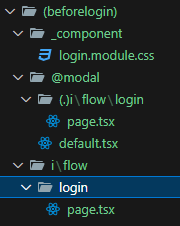

# NextJs - intro
## 프로젝트 생성
- npx create-next-app@latest
    - TypeScript, TailWind, src 사용 여부, app Router 사용 여부 체크

## 폴더 구조
- public : 사용자가 접근 가능한 사진 파일들을 저장
- src - app : route
    -주소 : @/.... == src/....

## 프로젝트 실행
- npm run dev

# NextJs src/app 폴더 구조
- 주소와 관련되어 있다.
- RootLayout 에 있는 코드는 모든 파일에 적용된다고 보면 된다. children이 교체되는 느낌으로
- RootLayout <= HomeLayout ... 와 같은 구조
- 유저의 아이디, 게시글 번호와 같이 유저에 따라 다른 값을 주소로 하는 경우 []를 활용
- ()를 활용한 경우 : 주소에 관여하지 않으며 (그룹)구조화에 도움
    - 주소에 영향 끼치진 않지만 layout 사용 가능

## template.tsx
- 매번 새롭게 mount 되기에, 페이지 이동 시 매번 리랜더링을 되도록 한다면 layout 대신 사용
- 페이지 넘어간 기록을 활용해야 하는 경우 활용 (공식 추천)
## Next에서만 사용하는 문법
- img => Image : Next자체가 알아서 최적화를 진행해준다. png파일을 import해서 사용 가능.
- a => Link (a태그는 새로고침되며 페이지가 이동함)
- redirect : 지정한 주소로 redirect
    ```
    import {redirect} from "next/navigation"
    
    export default function Login() {
        redirect('i/flow/login')
    }
    ```

## 본 강의에서 css module을 사용한 이유
- 물론 tailwind, sass, Styled Component or Emotion 들을 사용하는 곳도 많음. 하지만 이를 좋아하지 않는 곳도 많기에 각각의 입장을 모두 생각해보기.
    - tailwind : 호불호 문제, 가독성 좋지 못함.
    - Styled Component : Server Component SSR 에 문제
    - vanilla extract (window와의 문제)

### css module을 활용하는 방법
- style.module.css : 각 페이지마다 style을 적용하고 싶은 경우
- global.css : 모든 페이지에 적용할 스타일을 정의하는 경우

#### dvh, dvw
- CSS 단위 중 하나
- 주소창으로 틀어지는 레이아웃 문제 방지 가능

# Route
## Parallel
- @를 붙혀 파일 생성 (디렉토리 설정)
- A와 B를 같이 띄우고 싶다? 이 때 사용.
    - 단, A와 B(modal, @로 시작하는 폴더)가 같은 위치에 있어야 한다.
- 그 동시에, 일정 페이지에서 모달이 뜨도록 해야한다면? => 하위 폴더를 생성하고, @modal 폴더에 default.tsx를 생성한다.

- 즉, localhost:3000 => children : page.tsx, modal : @modal/default.tsx
- localhost:3000/하위주소 => children : 하위주소/page.tsx, modal : @modal/하위주소/page.tsx
```typescript
export default function Default() {
    return null;
}
```

## Intercepting

- 특정 url로 이동할 때, 중간에 그 주소를 가로채서 화면에 그려진다.
- 단, 모든 상황에서 가로채는 것은 아니고 Link를 통해 이동할 때 가로챈다.
    - 새로고침하는 경우, 원래의 주소 page.tsx가 그려진다.
- + 서버에서 리다이렉트 하는 경우에 Intercept 문제가 발생할 수 있다.
    - redirect하는 경우 client redirect로 바꾸는 작업이 필요함 (use client & useRouter)

#### useRouter Hook
- replace : 기록을 삭제하고 이동 ; 뒤로가기 한다면 뒤로 가는것이 아닌 그 전으로
- push : 기록을 남기고 이동 ; 뒤로가기 하는 경우 바로 전으로

# use client
- SSR 의 경우 Hook을 사용할 수 없다. (useState, useEffect, useSelected...Segment)
    - 이 문제를 해결하기 위해 상단에 use client 사용.
    - 물론 이렇게 한다고 CSR이 되는건 아니니 착각하지 말기.
- onClick과 같은 이벤트 리스너가 존재하는 경우 사용

# useSelectedLayoutSegment : 나의 위치 파악
- segment: useSelectedLayoutSegment()
  - segment는 나의 위치를 표시해주는 역할을 한다.
  - 즉, 나의 위치 (page.tsx가 존재하는 폴더)를 나타낸다는 것이다.
  - useSelected ... Segments : s를 추가하면 하위 폴더까지 표시 가능하다.
  - 

# NextJS에서 활용되는 TypeScript 내용
## 사용 방법
```typescript
import { ReactNode } from "react";

type Props = {children: ReactNode, modal: ReactNode};

export default function BeforeLogin({
    children,
    modal
  }: Props) {
    return (
      <html lang="en">
        <div>
            Before Login
            {children}
            {modal}
        </div>
      </html>
    );
  }
```
- children, modal은 ReactNode type

# Private folder (_폴더)
- url 주소에 영향을 주지 않는 폴더, 공통된 것들을 묶어두기 좋음.

# 좌우 균형 맞추기
- Flutter의 경우 Center을 하면 되긴함
- Nextjs 사용시 중앙배열을 해도 괜찮고, 양쪽에 flex-grow 1을 주는 방법으로도 구현 가능.

# Active Link
- 여러개의 Nav Bar가 있을 때, 클릭하면 Bold처리 등의 강조가 되는 Link의미
- 나의 현재 위치 => 강조 로직으로 구현해야함.
  - 이는 서버 컴포넌트에선 불가능하므로 use client
  - Next에서 제공하는 useSelectedlayoutSegment를 활용
    - 자식 폴더 하나만 있어도 된다? useSelectedLayoutSegment, 세부정보 필요하면 s 붙히고

# 반투명 component
- backdrop-filter: blur 12px;

# dayjs
- 몇초전 / 몇분전 게시글 작성 등 시간계산에 활용하는 라이브러리

# 클래스 합성
- 조건에 따라 다른 이미지(좋아요를 누른경우 등)를 표시해야 할 때 사용한다.
- classnames와 같은 라이브러리를 활용한다.
  - 조건을 주고, 조건에 따라 합성 여부 결정
  - 조건부 클래스를 관리하는데 도움이 되는 라이브러리

# npm trends
- 라이브러리 트랜드를 확인할 수 있는 사이트로, 그래프를 보며 활용할 라이브러리를 결정하는 것도 괜찮다.
